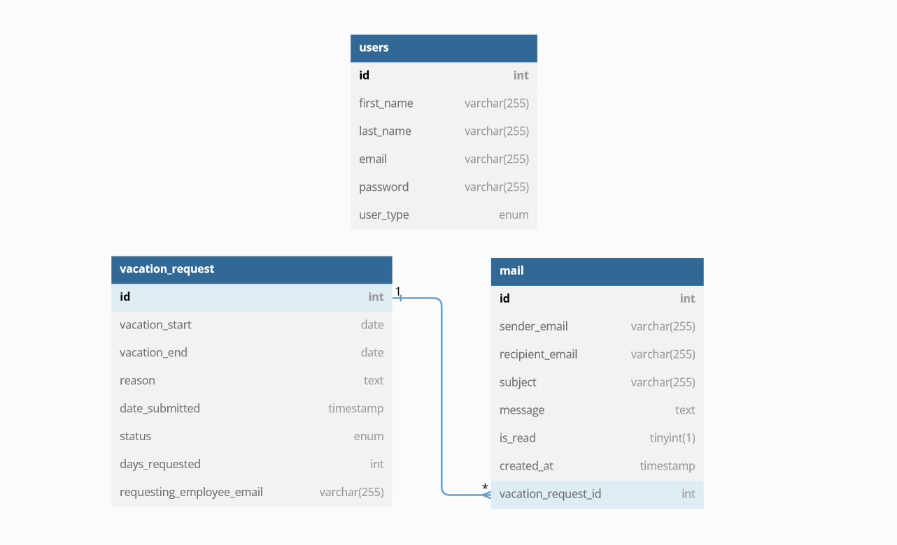

# VacationRequestPortal_PHP

This is a simple vacation request portal written in plain PHP. The application allows employees to submit vacation requests, which are then sent to their supervisors for approval using a mail server.

# Project Deliverables
Please find the project deliverables in the folder called "project_deliverables". It contains the ERD and the database dump.
## Prerequisites

Before running the application, make sure you have the following dependencies installed:

- XAMPP: A cross-platform web server solution that includes Apache, MySQL, PHP, and more. You can download XAMPP from the official website: https://www.apachefriends.org/index.html

- MailHog: A mail testing tool used to capture and view emails sent by the application during development. You can install MailHog using Composer.

- PHPMailer: A popular library for sending emails from PHP. You can install PHPMailer using Composer.

## Installation

1. Clone the repository into the `htdocs` folder of your XAMPP installation:
<br>
`git clone https://github.com/danieldimitriou/VacationRequestPortal_PHP.git `
2. Install the required dependencies by navigating to the project directory and running Composer:
<br>
`composer install`
3. Start the MailHog server by opening a command prompt and typing `mailhog`. Make sure the MailHog binary is added to the PATH variable.
4. In the php.ini file, under [mail function] change the SMTP address and accordingly:
 <br> 
```
[mail function]
   ; For Win32 only.
   ; http://php.net/smtp
   SMTP=127.0.0.1
   ; http://php.net/smtp-port
   smtp_port=1025
```
and in the sendmail.ini, under [sendmail], add the SMTP server address and port as well. 
<br>
```
[sendmail]

; you must change mail.mydomain.com to your smtp server,
; or to IIS's "pickup" directory.  (generally C:\Inetpub\mailroot\Pickup)
; emails delivered via IIS's pickup directory cause sendmail to
; run quicker, but you won't get error messages back to the calling
; application.

smtp_server=127.0.0.1

; smtp port (normally 25)

smtp_port=1025
```

files in the xampp folder to use the correct .  
5. Configure the database connection settings by editing the `config.php` file located in the App/Config directory. Update the database hostname, username, password, and database name according to your setup.

6. Import the provided SQL file (`database.sql`) into your MySQL database to create the necessary tables.


## Usage

1. Start the XAMPP control panel and ensure that the Apache and MySQL services are running.
2. Start the MailHog service.

2. Access the application by opening a web browser and navigating to `http://localhost/EpignosisPortal/App/Views/Login/login.php` This is the starting page for either user.

3. Use the application to submit vacation requests, approve or reject requests as a supervisor, and manage employee information.

## More detailed usage

### Flow of the application
First thing any user must do is login using their credentials. <br>_Note: The database.sql creates 2 users: an admin and an employee. Please refer to the table below to login and use the app. You can create more users by logging in as the administrator._
<br><br>

| Email             | Password | User Type |
| ----------------- |----------|-----------|
| john@example.com | password | Employee  |
| jane@example.com | password | Admin     |

After providing the credentials, the user is authenticated and redirected to either the employee home page or to the administrator's home page based on the logged in user's
type(either employee or admin).<br><br> The employee's home page includes all their previously sent vacation requests as well as a button to submit a new request. If an employee submits a new request, an email is automatically sent
to the administrator's email(this implementation assumes there's only 1 administrator. it could be improved by adding a column to the user table for their supervisor and getting their email.).
When the administrator logs in, they can view a list of all users. Clicking on any of these users redirects to a page that allows the admin
to update the user's information. <br><br>
In both the employee and admin interfaces, a navigation bar appears that contains a link to the user's email notification.
There, they can view their inbox and outbox emails, and the administrator can accept or deny requests that are in their inbox. After that,
the email and the vacation request are updated, and the email no longer shows in the inbox.
# ERD Diagram of the Database



### To change in the future:
1. Add a relationship between the user and the vacation request, instead of using the user's email.
2. Implement a router for redirecting more efficiently
3. Make the URL's shorter/prettier(.htaccess does not work currently)
4. Add more type checking
5. Implement better constructors for the objects
6. General code decluttering and formatting
7. Modularization of certain parts
